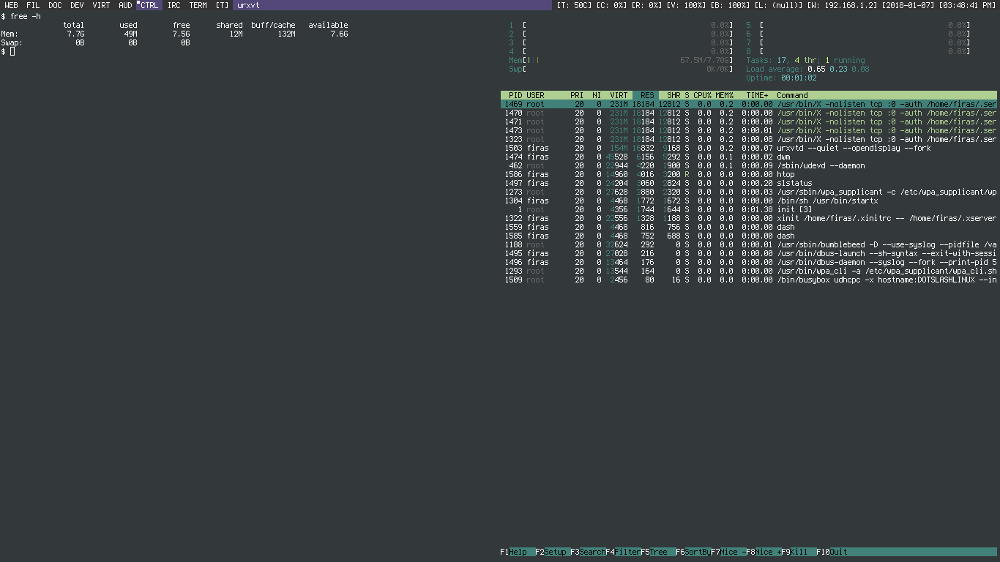
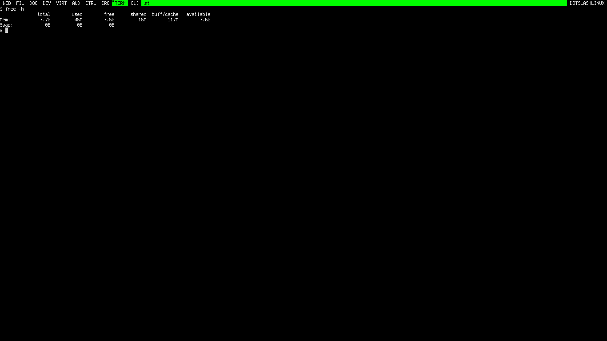
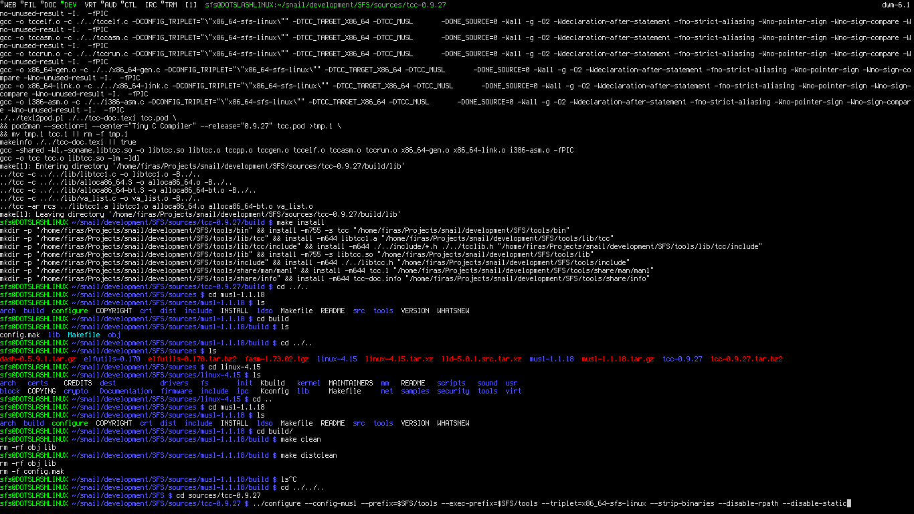
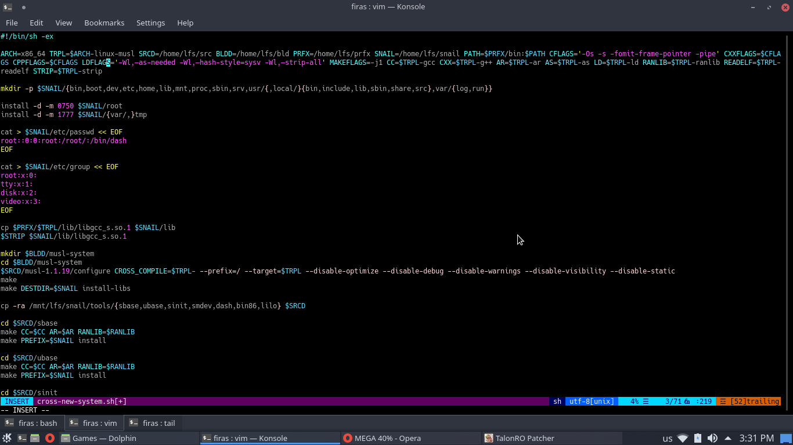
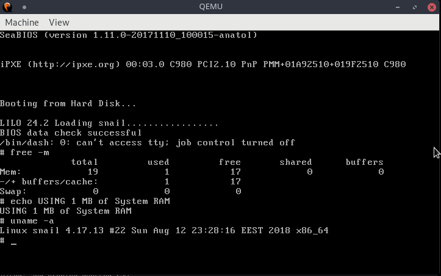
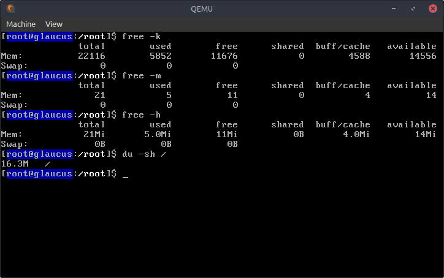
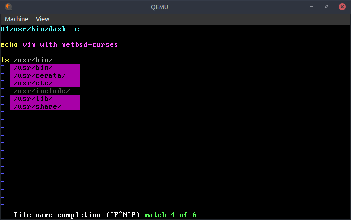
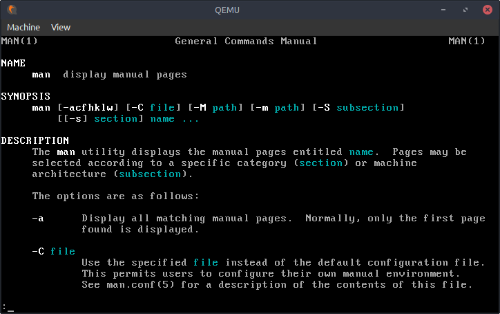

# i. Foreword
## i.1. When It All started
The year is 2014, I had just started using a GNU/Linux distribution (Arch Linux
to be precise). I was searching for what I naively thought at the time was the
most advanced and most performant GNU/Linux distribution.

My goal was to squeeze as much performance as I could from my trusty Satellite,
and to some extent I was able to do that. I was surprized by how well a
GNU/Linux distribution faired when compared to Windows when performing the
simplest as well as the hardest of tasks.

## i.2. Commence the Gentoo Phase
Throughout my journey, I was shocked by how little resources GNU/Linux
distributions used in general. This shock soon turned into an obsession about
how I could further trim my (GNU/)Linux system without sacrificing convenience.
Little did I know that this obsession will eventually force me to try Gentoo
when I was still a newbie in my Linux journey.

With Gentoo, I was astonished by how much you could customize a distribution
without breaking it. I found myself disabling USE flags all over the place,
removing those that I had no USE of (pun intended). I slowly ended up with a
lightweight system that had everything I needed, but I still wasn't satisfied.

## i.3. Begin the DOTSLASHLINUX Phase
Deep down the rabbit hole I went... I started figuring out how to further strip
my Gentoo installation without breaking it. I created DOTSLASHLINUX a static
website that was tailored for the needs of GNU/Linux enthusiasts who were fond
of lightweight open-source software and the suckless philosophy. The site itself
was extremely lightweight and fully responsive. It also had a working comments
system to showcase that lightweight doesn't necessarily mean inconvenient.

I wrote guides on how to replace popular applications with lightweight and even
suckless alternatives that provided similar if not identical functionality. I
provided configurations for dwm and was one of the first people to use slstatus
in a dwm desktop.

But that wasn't enough, so I added more guides on how to start Xorg using xinit,
and how to boot the Linux kernel on Gentoo without an initrd/initramfs. I soon
found myself posting a guide on how to build microcode updates directly into the
kernel itself for a more minimalist system. Along the way, I contributed an
in-depth guide on how to correctly setup bumblebee on Gentoo.

Sadly (or luckily I guess), my obsession lead me to start experimenting with the
Linux kernel configuration options and how much of them I could disable without
breaking my system. From the plethora of available options, I ended up with 645
included ones. These options were so minimal that excluding one rendered the
system in an unbootable or broken state. They also included all needed modules
built directly into the kernel itself.

As shown in the image above, I ended up with an extremely minimal Gentoo
installation that ran under 30 MBs of RAM when Xorg wasn't running, and was just
under 50 MBs when Xorg, dwm and slstatus were running. The system had bumblebee
fully working and ran everything fine.

I started documenting all the knowledge that I've gathered while configuring the
kernel into a huge 18 part guide that explained what configuration option I
enabled and the rationale behind it. The guide also discussed some of the
disabled options and why understanding what they did was crucial before
disabling them.

Unfortunately, the guide was left unmaintained at version 4.14.12 because I lost
interest after I attempted to recompile my entire Gentoo installation with
`-Ofast` and my bootloader (LILO at the time) started acting weird and wasn't
able to detect anything on my HDD. So I decided it's time to leave Gentoo and
try other distributions. Here's the last image I took of my Gentoo desktop (that
sweet 45 MB RAM usage).

## i.4. The Calm Before the Storm
I tried Void, Crux, Fedora, OpenSUSE Tumbleweed, Dragora, Parabola, the BSDs and
many more but I wasn't offered as much configuration as I wanted, and I didn't
have the time, so I was stuck with Arch, which surprisingly served me well and
is still my daily driver to this day.

However, there was a comment on DOTSLASHLINUX that was posted on the last part
of the kernel configuration series (part 18). The comment was posted out of good
deed and had the following sentence *"I wonder how far you can mush this
minimalistic behaviour..."*. It shook me to the core because I didn't know how
minimal I should go, especially after my Gentoo installation failed me (because
of what I did), so I started planning how I could build the most minimal
distribution ever that didn't sacrifice convenience.

At the time, I was barely 3 years into my Linux journey and I started developing
my own distribution from scratch. At first, I refrained from reading Linux From
Scratch (LFS) because I wasn't content with the fact the resulting distribution
is similar every other distribution.

## i.5. The Nightmare Phase Begins
I started looking into all of the available options and choosing the lightest of
them all. I began experimenting with a TCC, musl and elftoolchain toolchain (no
pun intended ;)), and decided to make suckless base (sbase) and LibreSSL my
comparison standard to tell if my toolchains are capable enough or not. I was
lucky enough to find an image from this phase (beware it can, no it will give
you nightmares).

At the time, I picked snail to be the name of this abomination of a distribution
that I was creating. So yes as expected TCC failed to build a complete sbase (it
didn't compile all of sbase so some tools were missing), and I deemed this
toolchain (TCC, musl and elftoolchain) as a complete failure. So I called it
quits and ended the whole thing... Just kidding, I love to torture myself
apparently don't I xD

I then switched to PCC and elfutils/elftoolchain, and things were looking much
better. I was able to build the entirety of sbase but PCC's optimization was
really lacking when compared to GCC's. The binaries that resulted from `gcc -Os`
were smaller than those from `pcc -Os`.

At this point of time, I was following a script created by a guy named z3bra. I
read z3bra's posts on a forum called nixers, and he was working on a cross PCC
musl toolchain. It was thanks to the following links that I was able to get my
feet wet with the whole toolchain building thing(ie xD):

*   [z3bra's thread on nixers](https://nixers.net/showthread.php?tid=1655)
*   [z3bra's blog post](https://blog.z3bra.org/2015/08/cross-compiling-with-pcc-and-musl.html)
*   [z3bra's cross-pcc.sh](http://pub.z3bra.org/monochromatic/misc/cross-pcc.sh)

This was followed by my decision to ditch elfutils/elftoolchain completely as
they didn't work well with musl and neither included the entire tools offered by
binutils (basically you'll end up mixing both elfutils and elftoolchain tools
trying to cover the basic ones offered by binutils), so I was stuck with GCC and
binutils (surprise surprise...).

For those who are wondering why I didn't experiment with LLVM, it's because I
was trying to limit the amount of cerata (fancy word for packages, refer to the
Naming Convention if you didn't know it already) using c++. I also tested libc++
and libstdc++ was faster (due to regressions in libc++). I didn't try lld, as I
was interested more in gold, I went back to bfd/ld after I found out the hard
way that gold doesn't build with musl unless PIE is enabled (which is something
I didn't plan on using early on).

I might switch to lld in the distant future and maybe give GOLD another chance,
but I won't be changing the design of the toolchain, especially after I got it
working perfectly with the optimizations I'm using.

## i.6. Introducing snail
Presented with so many options, I was delighted (and overwhelmed) that I opted
for creating my own Linux distribution (yes Linux only as I wasn't planning on
using enough GNU software to add the GNU to it). I went with suckless software,
choosing suckless base (sbase) and unportable base (ubase) to replace GNU
coreutils. I also went with sinit and svc for my init system and service manager
respectively.

I decided to call this abomination that weighed only 6 MBs of storage space and
ran in about 1 MB of RAM (sometimes running under 1 MB of RAM) snail.

Even though snail was a read-only Linux distribution (please bare with me as I
call it a distribution), it sometimes ran under 1 MB of RAM which made me really
happy as I was able to achieve my goal of creating a tiny distribution that ran
under 1 MB of RAM with the latest Linux kernel at the time.

But that wasn't enough for me (I think you now know that the rabbit hole I dug
is slowly reaching the other side of the Earth), as snail was barely usable. I
sacrificed all convenience to achieve extreme minimalism. It was at that moment
that I though if only I could add those extra 20 or 30 MBs of RAM and get all
the features that I had on my Gentoo installation then that would be great.

I started thinking of a way of slowly building snail up into something more
usable... something that was both lightweight and convenient. I decided that for
me to do that, I needed to rewrite snail from scratch in POSIX DASH and give the
project a new name, so I went with something even smaller (the irony) but much
more venemous, glaucus.

## i.7. Introducing glaucus
glaucus was born as an attempt to fix snail and turn it into a usable Linux
distribution that's not only extremely lightweight, but also highly optimized
for performance and much more convenient.

The first version of glaucus (31082019) was built from a cross GCC and musl
toolchain (which was a poor design choice as cross toolchains will only get you
as far as the graphics stack, but once you're there it's almost impossible to
achieve maximum isolation from the host to get things to compile successfully
without relying on tools provided by the host) (suddenly I feel myself thinking
closely to what the Linux From Scratch (LFS) were preaching).

The first version (31082019) of glaucus was much more convenient than snail. It
featured loksh as the user shell which supported both tab completion and command
history (features that snail's user shell DASH lacked). I also complemented both
sbase and ubase with extra tools from the OpenBSD userspace to cover coreutils
entirely, and ditched sinit and svc in favor of skarnet's s6 and s6-rc.

The resulting system was also extremely lightweight weighing at only 16 MBs of
storage space and running at about 5 MBs of RAM, but was much more convenient.
Many cerata (packages) were also compiling and running just fine such as top,
vim and mandoc (a lightweight but capable alternative to man for viewing man
pages).

## i.8. Fixing glaucus
But unfortunately (or fortunately), it was at this point that I began to regret
my poor design decisions that could be summarized in the following list:

1.   I went with the latest upstream version for available software, and by
     latest I the developmental versions or git versions, which was easier to
     upgrade as submodules but was harder to maintain due to the constant
     changes.  I had a cross GCC musl toolchain built with the latest
     developmental versions of GCC 10, gmp, mpfr, mpc, isl (the latest ISL with
     Graphite optimizations enabled) and zstd (since zstd support was added to
     GCC 10, this meant that this toolchain performed LTO optimizations using
     zstd as the default compression method and zlib as the fallback method).

2.   By making the toolchain a cross toolchain only I wasn't able to build a
     working graphics stack as the host tools and libraries were leaking into my
     binaries regardless of how much isolation I perform.

I knew I had to fix these problems before advancing glaucus's development, so I
decided to give Linux From Scratch (LFS) a try even though it's using much
different tools than the ones I'm using.

It was also around this time that I discovered Musl-LFS developed by dslm4515,
and he was building Linux From Scratch using musl libc and s6 and S6-rc as the
init and service management systems respectively. Musl-LFS had a working GCC and
musl toolchain using many patches from Void Linux, but it really was a chore to
build as you'd have to build some of its components several times to achieve
maximum isolation. For example, GCC is built 5 times in Musl-LFS, two times for
the cross toolchain, and two times for the native toolchain and one time when
installed as a system package.

This isn't ideal and can be shortened down by carefully inspecting what LFS does
with its toolchain. You need to build a cross binutils then build a stripped
down static version of cross GCC (we'll call it cross GCC), then we'll use this
cross toolchain to natively compile musl, libstdc++-v3, binutils and gcc. This
is identical to the way LFS builds its toolchain, but apparently everyone was
building cross GCC twice when using musl (apparently this is how CLFS was
building its GCC and musl toolchain).

This shortened the times needed to build GCC to 3, one for the cross toolchain
(and it's a fast build as most of this GCC's features are disabled, except for
those needed to compile the native toolchain, and it's also not optimized as
there's absolutely no need to optimize this temporary GCC version) and one for
the native toolchain, and one for the final system ceras (package).

I also had to migrate to the latest available stable versions of the software I
was using, and this took a lot of time, but I did it.

## i.9. What Is glaucus Now?
glaucus in its current state is a bunch of shell scripts written in POSIX DASH,
that build a musl libc and toybox based Linux® distribution from scratch.

## i.10. Linux From Scratch (LFS) vs glaucus
If I were to compare the resulting system built with LFS to glaucus, then the
following tables would summarize the differences:

The cross toolchain:

| Linux From Scratch (LFS) | glaucus             |
| ------------------------ | ------------------- |
| binutils                 | binutils            |
| gcc                      | gcc                 |

The native toolchain:

| Linux From Scratch (LFS) | glaucus             |
| ------------------------ | ------------------- |
| linux-headers            | -                   |
| glibc                    | musl                |
| libstdc++-v3             | libstdc++-v3        |
| binutils                 | binutils            |
| gcc                      | gcc                 |

The chroot (temporary) environmennt (glaucus's order is different, but it's
displayed as is for ease of comparison with LFS's order):

| Linux From Scratch (LFS) | glaucus             |
| ------------------------ | ------------------- |
| tcl                      | -                   |
| expect                   | -                   |
| dejagnu                  | -                   |
| m4                       | m4                  |
| ncurses                  | netbsd-curses       |
| -                        | oksh                |
| -                        | dash                |
| bash                     | bash                |
| bison                    | bison               |
| bzip2                    | lbzip2              |
| coreutils                | toybox              |
| -                        | rsync               |
| diffutils                | diffutils           |
| file                     | file                |
| findutils                | findutils           |
| gawk                     | mawk                |
| gettext                  | gettext-tiny        |
| grep                     | grep                |
| -                        | zlib-ng             |
| gzip                     | pigz                |
| make                     | make                |
| patch                    | patch               |
| perl                     | perl                |
| python                   | -                   |
| sed                      | sed                 |
| tar                      | libarchive          |
| texinfo                  | texinfo             |
| xz                       | xz                  |

The final system:

| Linux From Scratch (LFS) | glaucus             |
| ------------------------ | ------------------- |
| linux-headers            | linux-headers       |
| man-pages                | -                   |
| glibc                    | musl                |
| zlib                     | zlib-ng             |
| bzip2                    | lbzip2              |
| xz                       | xz                  |
| file                     | file                |
| readline                 | libedit             |
| m4                       | m4                  |
| bc                       | bc                  |
| binutils                 | binutils            |
| gmp                      | gmp                 |
| mpfr                     | mpfr                |
| mpc                      | mpc                 |
| -                        | isl                 |
| attr                     | attr                |
| acl                      | acl                 |
| -                        | skalibs             |
| -                        | utmps               |
| shadow                   | shadow              |
| gcc                      | gcc                 |
| pkg-config               | pkgconf             |
| ncurses                  | netbsd-curses       |
| libcap                   | libcap              |
| sed                      | sed                 |
| psmisc                   | psmisc              |
| iana-etc                 | -                   |
| bison                    | bison               |
| flex                     | flex                |
| grep                     | grep                |
| -                        | oksh                |
| -                        | dash                |
| bash                     | bash                |
| -                        | slibtool            |
| libtool                  | libtool             |
| gdbm                     | gdbm                |
| gperf                    | gperf               |
| expat                    | expat               |
| inetutils                | -                   |
| perl                     | perl                |
| perl-xml-parser          | perl-xml-parser     |
| intltool                 | intltool            |
| autoconf                 | autoconf            |
| automake                 | automake            |
| kmod                     | kmod                |
| gettext                  | gettext-tiny        |
| -                        | libuargp            |
| -                        | musl-fts            |
| -                        | musl-obstack        |
| elfutils-libelf          | elfutils-libelf     |
| libffi                   | libffi              |
| openssl                  | libressl            |
| python                   | python              |
| ninja                    | samurai             |
| meson                    | meson               |
| coreutils                | toybox              |
| check                    | -                   |
| diffutils                | diffutils           |
| gawk                     | mawk                |
| findutils                | findutils           |
| groff                    | -                   |
| grub                     | grub                |
| less                     | less                |
| gzip                     | pigz                |
| zstd                     | -                   |
| iproute2                 | iproute2            |
| kbd                      | kbd                 |
| libpipeline              | -                   |
| make                     | make                |
| patch                    | patch               |
| man-db                   | mandoc              |
| tar                      | libarchive          |
| texinfo                  | texinfo             |
| vim                      | vim                 |
| -                        | execline            |
| -                        | s6                  |
| procps-ng                | procps-ng           |
| util-linux               | util-linux          |
| e2fsprogs                | e2fsprogs           |
| sysklogd                 | -                   |
| sysvinit                 | s6-linux-init       |
| -                        | s6-rc               |
| eudev                    | eudev               |
| -                        | s6-boot-scripts     |
| linux                    | linux               |

As you can see, many of LFS's packages were replaced by alternatives that are
lighter or provide better performance.

## i.11. The Aim of This Book
This book aims to provide you with the knowledge necessary to build glaucus from
scratch.

## i.12. The Voyager (Author)
Firas Khalil Khana

firasuke@glaucuslinux.org
